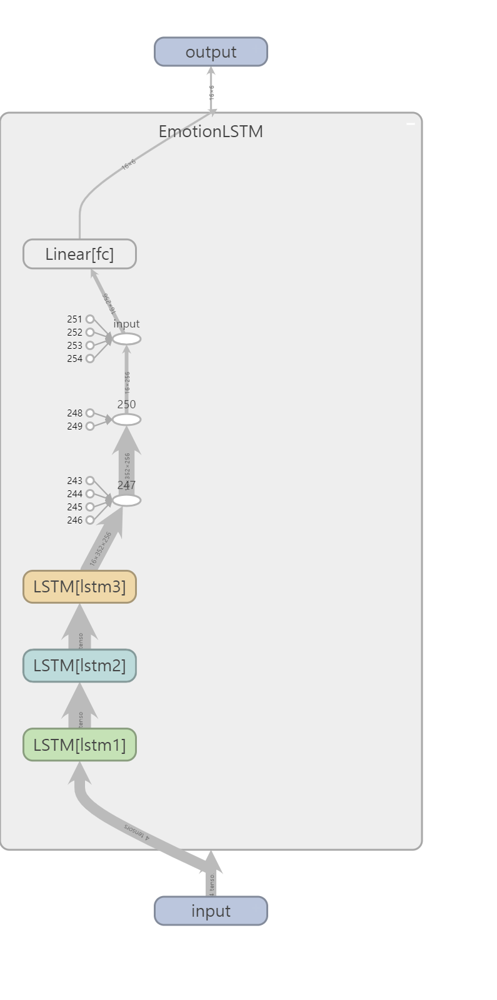
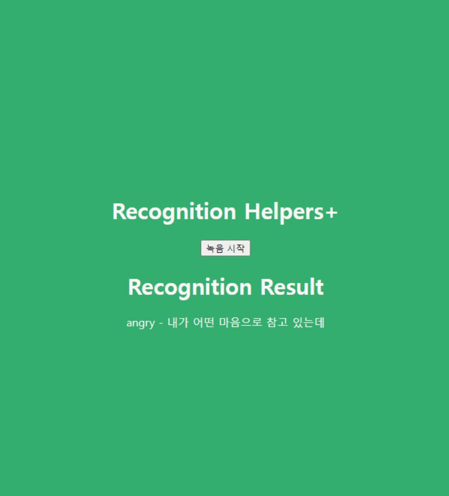

# **RecognitionHelpers**

## **구현목표**
청각 장애인에게 도움이 될 수 있는 서비스 - 버튼을 눌러 음성인식을 시작하여 음성인식 결과와 발화자의 감정 예측결과를 보여주는 서비스

---
## **음성인식**
- 추가예정
---
## **감정인식**
### 사용된 dataset
- 감정 분류를 위한 대화 음성 데이터셋(한국어) - https://aihub.or.kr/aihubdata/data/view.do?currMenu=&topMenu=&dataSetSn=263&aihubDataSe=extrldata
- RAVDESS - https://www.kaggle.com/datasets/uwrfkaggler/ravdess-emotional-speech-audio
- TESS - https://www.kaggle.com/datasets/ejlok1/toronto-emotional-speech-set-tess
- CREMA-D - https://www.kaggle.com/datasets/ejlok1/cremad
- SAVEE - https://www.kaggle.com/datasets/ejlok1/surrey-audiovisual-expressed-emotion-savee
  
### 개발 진행 과정
1. 한국어 오디오 데이터셋으로 Mel-spectrogram을 추출하여 기본적인 CNN으로 학습 -> 성능이 안좋음
2. 모델을 wav2vec pre-trained된 모델로 변경 -> 추가 학습이 어렵고 모델이 굉장히 무거움
3. MFCC추출하여 3x224x224 image로 만든후 resnet, googlenet으로 학습 : 정확도 50%가 최대
4. 데이터셋을 영어 데이터셋으로 변경하여 학습 : 정확도 최대 80%
5. 모델 전처리 과정에 librosa.effects.normalize, ZCR, RMS추가
6. 모델을 LSTM기반 모델로 변경 -> 정확도 test, validation dataset에서 최대 80% 이상, 그러나 한국어 데이터에 대해서는 매우 안좋은 결과가 나옴

### 모델
구체적인 학습과정은 ./emotion_recognition 폴더의 speech-emotion-recognition.ipynb,resnet_newdataset.ipynb 에서 확인 가능합니다.
실제로 학습을 해보고 싶다면 ./emotion_recognition 폴더의 train.ipynb을 참고해주세요.
학습시 변경 가능한 파라미터는 다음과 같습니다.
- preprocess_audio의 top_db를 바꾸면 오디오 전후에서 노이즈로 인식하는 소리의 크기를 설정할 수 있습니다.
- preprocess_audio의 수치를 바꾸어 읽을 오디오 데이터의 길이를 정할 수 있습니다. 현재 기본값은 180000입니다.
- 전처리 코드에서 X의 구성을 바꾸어도(다른 feature를 사용하여도) 동일하게 코드가 사용가능합니다.
- EmotionLSTM(X.shape[1:3],hidden,n_class)에서 hidden을 통해 LSTM의 히든레이어 수가 변경됩니다.
- 만약 label의 개수가 6개가 아닌 다른 데이터 셋을 사용한다면 n_class를 수정해주시면 됩니다.
- CNN모델의 경우 resnet18, resnet50, googlenet을 사용해보았지만 다른 CNN 모델을 사용하셔도 됩니다.

### 문제점
- dB이 커질수록 예측 결과가 happy, angry로 귀결됨
- 입력 음성데이터의 db을 일반화하는 전처리과정이 필요함 (이러한 효과를 노리고 librosa의 normalize를 사용했으나 효과가 없었음)
---

## **demo 사용방법**
### 설치(windows)
pytorch 설치
~~~
conda install pytorch torchvision torchaudio pytorch-cuda=11.8 -c pytorch -c nvidia
~~~
음성인식을 위한 Nvidia의 NeMo toolkit설치
NeMo toolkit설치시에 윈도우에서는 C++ 빌드 툴이 없으면 설치가 제대로 되지않습니다. visual c++ build를 설치하셔야 합니다.
c++ build가 있어도 pynini는 제대로 설치가 안되기 때문에 아래와 같이 따로 설치를 하셔야합니다.
~~~
conda install -c conda-forge pynini
pip install Cython
pip install "nemo_toolkit[all]"
~~~
demo app 실행을 위한 라이브러리 설치
~~~
pip install SpeechRecognition
pip install pyaudio
~~~
앱 실행 - 로딩이 다되고 나서 127.0.0.1:5000에 접속하시면 됩니다. ___첫 접속에서는 화면이 뜨지 않는채로 음성인식을 받습니다.___
~~~
python app.py
~~~

---
## 디렉토리 구성
- emotion_recognition : 감정인식 연습 및 학습용 폴더입니다.
- model_state_dict : 학습된 모델 파라미터입니다.
- templates : demo app에서 보여줄 HTML파일입니다.
- utils : emotion_model.py에서 사용할 함수들이 저장되어 있습니다.
- app.py : 데모앱 실행 파일입니다.
- emotion_model.py : 감정인식 모델이 저장되어 있습니다.