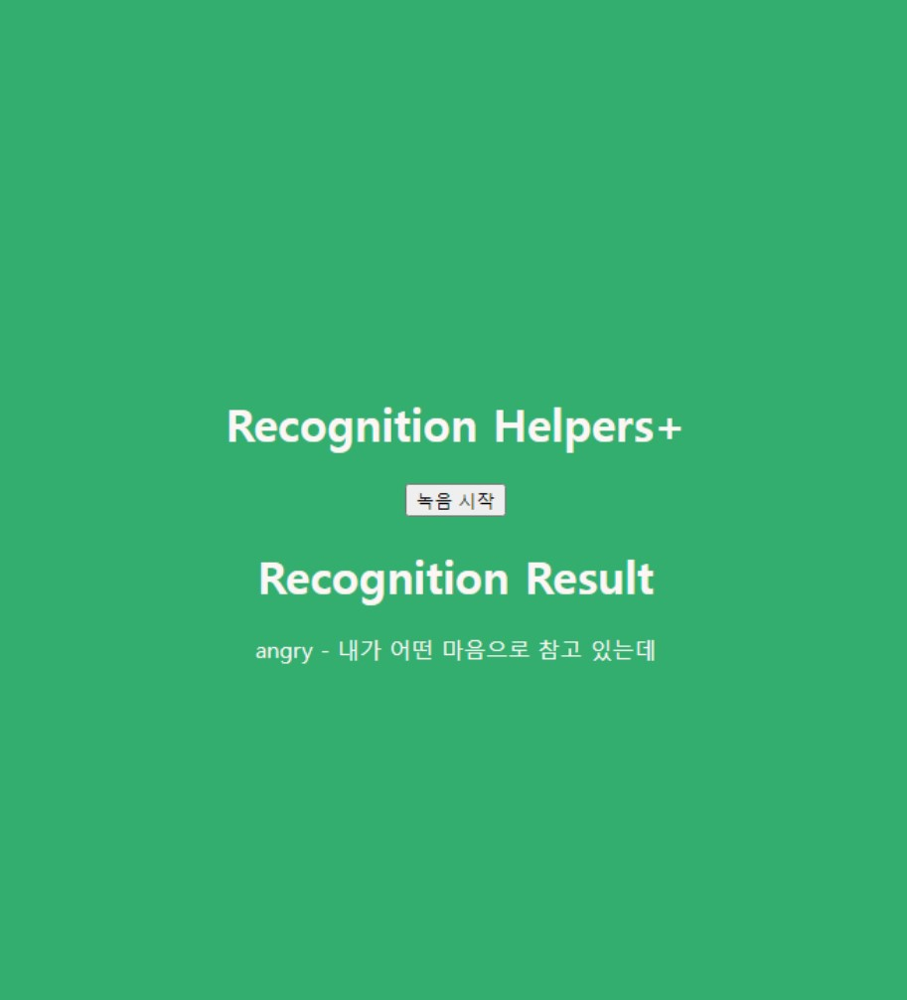

# **RecognitionHelpers**

## **Implementation Goal**
A service that aids the hearing impaired - it initiates speech recognition at the push of a button, displaying the results of the speech recognition and the speaker's predicted emotional state.

---
## **Speech Recognition**
- To be added
---
## **Emotion Recognition**
### Datasets used
- Dialog audio dataset for emotion classification (Korean) - https://aihub.or.kr/aihubdata/data/view.do?currMenu=&topMenu=&dataSetSn=263&aihubDataSe=extrldata
- RAVDESS - https://www.kaggle.com/datasets/uwrfkaggler/ravdess-emotional-speech-audio
- TESS - https://www.kaggle.com/datasets/ejlok1/toronto-emotional-speech-set-tess
- CREMA-D - https://www.kaggle.com/datasets/ejlok1/cremad
- SAVEE - https://www.kaggle.com/datasets/ejlok1/surrey-audiovisual-expressed-emotion-savee
  
### Development process
1. Extracted Mel-spectrogram from Korean audio dataset and trained with a basic CNN - results were poor
2. Switched model to a wav2vec pre-trained model - additional training was difficult and the model was quite heavy
3. Created a 3x224x224 image by extracting MFCC, trained with resnet and googlenet - maximum accuracy was 50%
4. Changed the dataset to an English dataset for training - maximum accuracy was 80%
5. Added librosa.effects.normalize, ZCR, RMS in the preprocessing step of the model
6. Changed the model to an LSTM-based model - maximum accuracy was over 80% on test and validation datasets, but very poor results for Korean data

### Model
Detailed learning processes can be found in the speech-emotion-recognition.ipynb and resnet_newdataset.ipynb files in the ./emotion_recognition directory.
If you actually want to conduct the training, please refer to the train.ipynb in the ./emotion_recognition folder.
The parameters that can be modified during the training process are as follows:
- By changing the top_db of preprocess_audio, you can set the volume of the sound that is recognized as noise before and after the audio.
- By changing the values of preprocess_audio, you can determine the length of the audio data to read. The current default value is 180,000.
- Even if you change the composition of X in the preprocessing code (using a different feature), the code can still be used in the same way.
- In EmotionLSTM(X.shape[1:3],hidden,n_class), the number of hidden layers of LSTM can be changed through 'hidden'.
- If you are using a dataset with a number of labels different from 6, please modify n_class.
- In the case of the CNN model, we tried using resnet18, resnet50, and googlenet, but you can also use other CNN models.

### Challenges
- As the dB grows, prediction results are biased towards 'happy' and 'angry'
- Preprocessing to normalize the decibel level of the input voice data is needed (tried using librosa's normalize function to achieve this, but it was ineffective)
---

## **Demo User Guide**
### Installation (Windows)
Install PyTorch
~~~
conda install pytorch torchvision torchaudio pytorch-cuda=11.8 -c pytorch -c nvidia
~~~
Install Nvidia's NeMo toolkit for speech recognition
The NeMo toolkit requires the installation of the Visual C++ Builds Tool on Windows. If you don't have it, it won't install properly.
Even with the C++ builds tool, pynini may not install correctly, so you need to install it separately as follows.
~~~
conda install -c conda-forge pynini
pip install Cython
pip install "nemo_toolkit[all]"
~~~
Install libraries for running the demo app
~~~
pip install SpeechRecognition
pip install pyaudio
~~~
Run the app - After all loading is complete, you can access 127.0.0.1:5000. ___Please note that on the first access, voice recognition will start even though the screen is not displayed.___
~~~
python app.py
~~~

---
## Directory Structure
- emotion_recognition: This folder is for practice and learning of emotion recognition.
- model_state_dict: This contains the parameters of the trained models.
- templates : These are HTML files to be displayed in the demo app.
- utils : This contains the functions to be used in emotion_model.py.
- app.py : This is the file to run the demo app.
- emotion_model.py : This file contains the emotion recognition model.